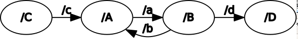
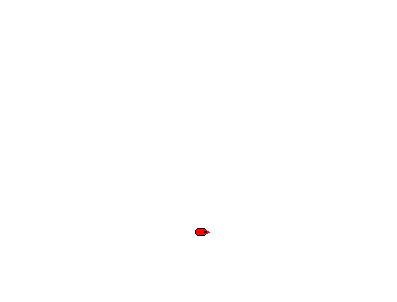
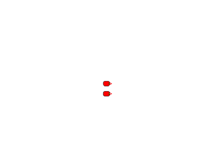
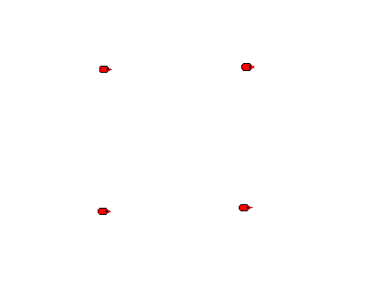
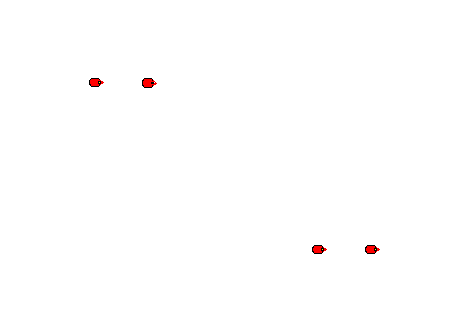

# ALS assignments as ROS package
This directory contains the code written for ROS based assignments for Artificial Life Simulation Course.

<!-- markdown-toc start - Don't edit this section. Run M-x markdown-toc-refresh-toc -->
**Table of Contents**

- [ALS assignments as ROS package](#als-assignments-as-ros-package)
    - [1. Setup pub-sub connections as per a given graph](#1-setup-pub-sub-connections-as-per-a-given-graph)
    - [2. Move a robot in MobileSim to a fixed goal](#2-move-a-robot-in-mobilesim-to-a-fixed-goal)
    - [3. Move a MobileSim robot in a square loop](#3-move-a-mobilesim-robot-in-a-square-loop)
    - [4. Make a robot follow another which is controlled from keyboard](#4-make-a-robot-follow-another-which-is-controlled-from-keyboard)
    - [5. Make a chain of bots following each other with leader controlled from keyboard](#5-make-a-chain-of-bots-following-each-other-with-leader-controlled-from-keyboard)
    - [6. Move robots from corner of a square to opposite with collision avoidance](#6-move-robots-from-corner-of-a-square-to-opposite-with-collision-avoidance)
    - [7. Move bots in a grid as shown with no collision](#7-move-bots-in-a-grid-as-shown-with-no-collision)

<!-- markdown-toc end -->


## 1. Setup pub-sub connections as per a given graph
[**code**](scripts/1-start-talking.py)

Given a graph as shown in image below, setup talker and subscriber nodes such that they transfer messages so that the connection graph appears as the image.


The solution reads the config graph from a json file and for each node prepares a list of nodes the current one will `talk to` and `listen to`.

After this, it starts each node in a different process, using Python's `multiprocessing`.

```bash
cd scripts
# Update the graph in connection-graph.json, if you want a different setup
python 1-start-talking.py

# To view the graph, run below cmd in another shell
rosrun rqt_graph rqt_graph
```

## 2. Move a robot in MobileSim to a fixed goal
[**code**](scripts/2-move-to-goal.py)

Given a goal, say `(0, 5)`, a robot in MobileSim needs to move from one point to another.

The solution models the velocity (linear and angular) of the robot as a `p-controller`. Linear velocity is proportional to the distance from goal with upper cap as 1.0 and same for angular velocity with upper cap as 1.0.

A goal is said to be reached if the distance from the goal is less than a lower bound (here, 1.0).



```bash
# Run these commands in different shells/windows
# Start roscore service
roscore

# Start MobileSim
MobileSim -r pioneer-lx --nomap

# Start RosAria
rosrun rosaria RosAria

# Start the required script
python scripts/2-move-to-goal.py
```


## 3. Move a MobileSim robot in a square loop
[**code**](scripts/3-move-square-loop.py)

The vertices of the square are at `(0, 0), (0, 5), (5, 5), (5, 0)`. The robot runs in a loop in the square.
The solution to this is similar to the previous problem, with the fact that the goal variable updates after one goal is reached.


```bash
# Run these commands in different shells/windows
# Start roscore service
roscore

# Start MobileSim
MobileSim -r pioneer-lx --nomap

# Start RosAria
rosrun rosaria RosAria

# Start the required script
python scripts/3-move-square-loop.py
```

## 4. Make a robot follow another which is controlled from keyboard
[**code**](scripts/4-follow-keyboard-bot.py)
    
There are two robots - `r1` and `r2`.
`r1` is controlled from keyboard via `teleop` package, while `r2` is controlled from program.
`r2` follows `r1`.



```bash
MobileSim -r pioneer-lx -r pioneer-lx --nomap

# To simplify, we'll now use a launch file instead of individual commands
roslaunch launchfiles/fourth.launch

# Control r1 from keyboard
rosrun teleop_twist_keyboard teleop_twist_keyboard /cmd_vel:=/r1/cmd_vel
```

## 5. Make a chain of bots following each other with leader controlled from keyboard
[**code**](scripts/5-robot-chain.py)

There are five robots, with the first one being controlled from keyboard, the second one following the first, the third follows the second, and so on.


```bash
MobileSim -r pioneer-lx -r pioneer-lx -r pioneer-lx -r pioneer-lx -r pioneer-lx --nomap

# To simplify, we'll now use a launch file instead of individual commands
roslaunch launchfiles/fifth.launch

# Control r1 from keyboard
rosrun teleop_twist_keyboard teleop_twist_keyboard /cmd_vel:=/r1/cmd_vel
```

## 6. Move robots from corner of a square to opposite with collision avoidance
[**code**](scripts/6-move-diagonal-collision-avoid.py)
Four robots placed on the corner of a square have to moved to the opposite side along the diagonal, making path adjustments for collision avoidance.
The gif shows the desired path.

**Collision avoidance** has been done by considering socio-potential field (applying a specific attraction force towards the goal and replusion from other robots).

Initial position of robots on MobileSim is done by dragging them to approximately the position we want (mentioned in the launch file as well).
The positions were transformed to world coordinate frame for calculating the net force due to socio-potential field.


```bash
MobileSim -r pioneer-lx -r pioneer-lx -r pioneer-lx -r pioneer-lx --nomap

# To simplify, we'll now use a launch file instead of individual commands
roslaunch launchfiles/sixth.launch
```

## 7. Move bots in a grid as shown with no collision
To start two robots from the ends of an "S", with other two following one each. See gif to get a better idea.
[**code**](scripts/7-follow-collision-avoid.py)


```bash
MobileSim -r pioneer-lx -r pioneer-lx -r pioneer-lx -r pioneer-lx --nomap

# To simplify, we'll now use a launch file instead of individual commands
roslaunch launchfiles/sixth.launch
```

---
NOTE: The `gifs` have been made by exporting frames from MobileSim at interval of 0.2s and [combining to a gif](https://askubuntu.com/a/648245) using [ImageMagick](https://imagemagick.org/).
